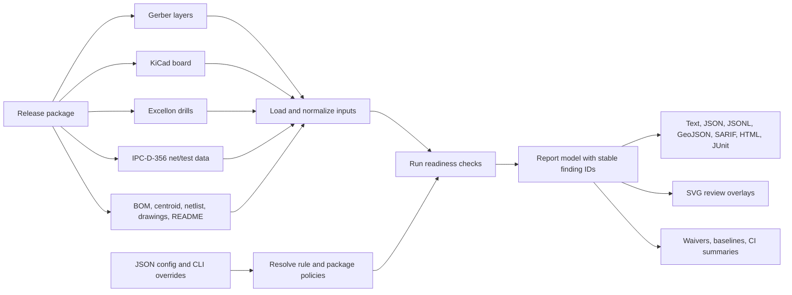

<h1>
  hyperdrc
  
</h1>

`hyperdrc` is a Rust library and thin command line tool for PCB
design-readiness checks over Gerber, KiCad, Excellon, and IPC-D-356 inputs. It
uses the latest git version of [`csgrs`](https://github.com/timschmidt/csgrs)
for Gerber parsing, polygon offsets, and boolean geometry.

## Current Status

`hyperdrc` is an active prototype with a broad regression suite for
fabrication-readiness rules. It supports layer-level Gerber checks, net-aware
KiCad checks, Excellon drill sidecars, IPC-D-356 electrical-test sidecars,
JSON/JSON Lines/GeoJSON/SARIF/HTML/JUnit/text reports, GitHub Actions
annotations, SVG review overlays, JSON waivers, JSON rule configuration,
TransJLC conversion, Gerber-directory sidecar discovery, and structured input
provenance with parser diagnostics.

The implemented checks are useful for CI and local design review, but they are
not a replacement for a fabricator's final DFM/DRC pass. Some geometry and
electrical intent remains conservative: KiCad oval and rectangular drill declarations are treated as
circular keepouts using their larger dimension until exact routed-slot geometry
is modeled, config-driven impedance checks verify declared stackup/reference
intent rather than solving impedance, and IPC-D-356 parsing focuses on common
test records and optional access-side/feature/soldermask hints rather than the
full fixed-column dialect.

## Workflow Overview



## Library And CLI Split

The reusable API lives in `src/lib.rs`. It exposes parser modules, check
modules, report types, rule policy modules, and the crate-root `run` entry
point. `run` returns a `RunOutcome` containing the serializable `Report` instead
of terminating the process, so Rust callers can embed `hyperdrc` in services,
tests, or custom CI tooling.

The binary in `src/main.rs` is intentionally thin: it parses `Cli` with `clap`
and calls `hyperdrc::run_cli`, which delegates to the library and then maps
active findings to the traditional non-zero process exit status.

## Quick Start

Run all default checks against one or more Gerber layers:

```sh
cargo run -- path/to/top.gbr path/to/bottom.gbr
```

Load every Gerber-like file from a directory. The same directory is also scanned
for common Excellon, IPC-D-356, BOM, centroid, netlist, README, fabrication
drawing, assembly drawing, and rout/panel drawing sidecars:

```sh
cargo run -- --gerber-dir path/to/gerber-package
```

Include pre-production sidecars for manifest-driven readiness checks:

```sh
cargo run -- \
  --check file-manifest-readiness \
  --bom parts.csv \
  --centroid placement.txt \
  --netlist netlist.csv \
  --fab-drawing fab.dxf \
  --assembly-drawing assembly.dxf \
  --readme release-notes.md \
  --rout-drawing panel.dxf \
  --declared-copper-layer-count 4 \
  --kicad-pcb board.kicad_pcb \
  --excellon board.drl \
  top.gbr \
  bottom.gbr
```

Convert a Gerber package with
[`TransJLC`](https://github.com/HalfSweet/TransJLC) before loading the converted
outputs:

```sh
cargo run -- \
  --convert-input path/to/source-gerbers \
  --conversion-output-dir build/hyperdrc-converted \
  --source-eda kicad \
  --transjlc-bin TransJLC \
  --conversion-arg --colorize \
  --conversion-arg --zip-name=upload
```

Run KiCad-aware checks against a `.kicad_pcb` file:

```sh
cargo run -- \
  --config examples/hyperdrc-config.json \
  --kicad-pcb board.kicad_pcb \
  --kicad-copper-layer F.Cu \
  --kicad-copper-layer B.Cu \
  --excellon panel-holes.drl \
  --ipc356 board.ipc \
  --format geojson
```

Run a specific check sequence:

```sh
cargo run -- \
  --check mask-island-keepout \
  --check copper-overlap \
  --keepout 0.2 \
  --pair 0:1 \
  --format json \
  path/to/mask.gbr path/to/copper.gbr
```

Layer roles are explicit zero-based indexes into the Gerber input list:

```sh
cargo run -- \
  --board-outline 2 \
  --copper-layer 0 \
  --copper-layer 1 \
  --paste-pair 3:0 \
  --mask-pair 0:4 \
  --silk-layer 5 \
  --silk-pair 5:4 \
  top.gbr bottom.gbr edge.gbr paste.gbr mask.gbr silk.gbr
```

Output formats are `text`, `json`, `jsonl`, `geojson`, `sarif`,
`github-annotations`, `html`, and `junit`. JSON reports include stable violation
IDs, severity, layers, polygon coordinates, point locations where applicable,
short messages, structured parser diagnostics, and a structured input manifest.
During a run, `hyperdrc` writes start/end status lines for runtime phases and
per-check execution to stderr with elapsed time; each completed check also
reports its new finding count. Expensive checks such as minimum copper neck,
mask sliver, aperture/opening spacing, drill-to-copper clearance, and net
spacing also emit intra-check progress lines so long-running layer or board
work can be monitored. This leaves stdout safe for the selected report format.
JSON Lines emits one run/input/diagnostic/violation object per line for
streaming analytics. SARIF output preserves stable hyperdrc finding IDs and PCB
geometry in result properties for CI/code-review systems. GitHub annotation
output emits workflow commands that surface findings in Actions logs. HTML
output embeds the SVG overlay with summary, parser diagnostic, input, and
finding tables for review packets. JUnit XML output maps active findings into
testcase failures for CI systems with JUnit publishers. SVG review overlays can
be written with `--svg-overlay violations.svg`.
Active-finding waiver stubs and baselines can be written with `--waiver-stubs
waiver-stubs.json` and `--baseline-file baseline.json`. A current run can also
be compared to a saved baseline with `--baseline-reference previous.json` and
`--baseline-diff-file baseline-diff.json`, producing new, resolved, and unchanged
finding buckets for release review.

Rule thresholds can be placed in a JSON config file and loaded with `--config`.
CLI flags override config values. See
[examples/hyperdrc-config.json](examples/hyperdrc-config.json).
The config also tunes package policy. `package_profile` accepts
`full-production`, `fabrication-only`, `assembly-only`, or `electrical-test`;
that profile sets default manifest expectations, and `required_artifacts` plus
`required_layers` can override individual deliverables. Generated-output
freshness is controlled with `generated_date_stale_days`. Assembly thresholds
can be selected with `assembly_profile` (`prototype`, `production-smt`,
`double-sided-smt`, `test-fixture`, `hand-assembly`, `selective-solder`,
`wave-solder`, `press-fit`, or `conformal-coating`) and tuned field-by-field in
`assembly`.
Stackup readiness accepts process metadata plus built-in or custom
`fabrication_capability` thresholds for finished thickness, copper layer count,
copper weight, dielectric thickness, laminate Dk/Df, and Tg.

## Readiness Coverage

The default suite covers the main `hyperdrc` readiness surfaces:

- Layer geometry: copper overlap, edge clearance, mask and paste alignment,
  silkscreen clearance, minimum feature width, polygon and trace-junction acid
  traps, whole-layer and local copper-density balance, and board-outline
  sanity.
- Drill and fabrication context: annular ring, drill spacing, drill-to-copper
  clearance, routed-slot readiness, castellation intent, aspect ratio, and
  cross-source drill-table consistency.
- KiCad board context: net intent, high-speed and high-current heuristics,
  reference-plane, split-plane, and return-proximity coverage, RF keepout, antenna copper-free
  region, and via-fence review, gold fingers, ESD proximity and TVS clamp
  return-path proximity, protective-earth spacing, surge-protection keepouts, panelization clearance, mounting-hole grounding,
  plating, edge-clearance, distribution, spacing, copper-keepout review,
  same-net drill-break continuity review, different-net short isolation review,
  differential pair width, neck-down, skew, via proximity/return, and pair-to-pair spacing review,
  high-current pad-entry and via-return support review,
  switch-node and inductor copper keepouts, panel-feature
  outline registration review, edge-plating intent, castellation pitch,
  component edge/hole clearance, dense-pad escape, pad/via spacing,
  mask-bridge review, thermal-via count/distribution, and config-driven
  stackup/net-class constraints for material, surface finish,
  laminate Dk/Df/Tg, soldermask process/color, IPC/fabricator class,
  fabrication capability thresholds, width, clearance, current, voltage,
  reference-plane, layer-count, via-count, approximate length/skew,
  differential-pair spacing, differential-pair return/guard proximity,
  mixed-signal partitioning, and impedance-control target/tolerance intent.
  Companion checks for thermal-via distribution, antenna copper keepout,
  TVS/ESD return path, inductor copper keepout, mixed-signal partitioning, and
  dense-pad via/mask review are also first-class CLI checks rather than only
  hidden side effects of broader review groups.
- Assembly and test readiness: profile-driven component edge/hole/spacing
  clearance, connector rework spacing, fiducials and fiducial copper keepouts,
  tooling holes, mouse bites, testpoint coverage/accessibility including
  IPC-D-356 access-side, soldermask, and KiCad pad-side parity hints,
  testpoint copper clearance, pad-pair asymmetry, dense-pad escape,
  selective/wave solder keepouts, press-fit keepouts, conformal-coating
  keepouts, and IPC-D-356 coverage.
- Production package readiness: Gerber package completeness, sidecar discovery,
  BOM/centroid/netlist structure, README release notes, fabrication and assembly
  drawings, rout drawings, order-parameter consistency, generated-date freshness,
  side-role filename conflict detection, paste/mask companion checks,
  configurable required artifacts/layers, centroid unit/origin/rotation
  convention handoff, BOM compliance/traceability/source-control evidence for
  sensitive rows, package-level polarity/MSL handoffs, polarized same-package
  centroid orientation review, dense-package reflow-profile handoff,
  tall-component height/keepout handoff, thermal-validation handoff for
  heat-dissipating rows, low-standoff cleanliness handoff, press-fit and
  wire-bond process/drawing handoff, fabrication marking-zone handoff, and
  surface-finish handoff notes.

The check implementations and exact ownership are documented in
[src/checks](src/checks/README.md). The roadmap and remaining gaps are tracked
in [docs/design-readiness-plan.md](docs/design-readiness-plan.md).

Important tunables include `--keepout`, `--clearance`, `--min-width`,
`--min-mask-width`, `--acid-trap-angle`, `--annular-ring`,
`--drill-clearance`, `--board-thickness`, `--max-drill-aspect-ratio`,
`--min-paste-area-ratio`, `--max-paste-area-ratio`, `--stencil-thickness`,
`--min-stencil-area-ratio`, `--max-copper-imbalance-ratio`, `--net-clearance`,
`--registration-tolerance`, `--panel-clearance`, `--ipc356-tolerance`,
`--min-area`, `--max-layer-area`, and `--generated-date-stale-days`.

## Waivers And CI

Waiver files are JSON and can suppress findings by `id`, `check`, `layers`, and
message text. The system also emits readiness warnings for incomplete waiver
metadata so production waivers remain auditable: `reason`, `owner`,
`review_date`, `source`, and `geometry_hash` are expected. `review_date` must be
an ISO `YYYY-MM-DD` date and is warned when it has expired, so standing
exceptions stay visible in pre-production review. A compact CI summary can be
written with `--summary-file`. Proposed waiver stubs and active-finding
baselines can be generated without suppressing anything. Baseline comparison is
an audit artifact: it classifies drift in the active finding set, but waivers
remain the mechanism for intentionally suppressing accepted findings.

```json
{
  "waivers": [
    {
      "check": "acid-trap-candidate",
      "layers": ["F.Cu"],
      "message_contains": "below 30",
      "reason": "accepted connector footprint geometry",
      "owner": "DRC reviewer",
      "review_date": "2027-05-01",
      "source": "https://jira.example/issues/123",
      "geometry_hash": "sha256:0000"
    }
  ]
}
```

```sh
cargo run -- \
  --kicad-pcb board.kicad_pcb \
  --waiver waivers.json \
  --summary-file summary.json \
  --svg-overlay violations.svg \
  --waiver-stubs waiver-stubs.json \
  --baseline-file baseline.json \
  --baseline-reference previous-baseline.json \
  --baseline-diff-file baseline-diff.json
```

## Repository Map

Each folder has its own local README with the hyperdrc-specific ownership
details for that part of the tree:

- [src](src/README.md): Rust crate structure, runtime pipeline, parsers,
  reports, configuration, and submodule map.
- [src/checks](src/checks/README.md): all design-readiness checks grouped by
  layer, drill, board, mechanical, stencil, assembly, manifest, artifact,
  surface-finish, and helper responsibilities.
- [src/geometry](src/geometry/README.md): polygon construction, sketch
  conversion, shape extraction, and geometry-test expectations.
- [src/kicad](src/kicad/README.md): KiCad board model, S-expression parsing,
  graphics parsing, and current parser scope.
- [docs](docs/README.md): roadmap, design-readiness backlog, and visual assets.
- [docs/testing.md](docs/testing.md): test-suite guide explaining what the
  current tests look for and how they exercise `hyperdrc`.
- [examples](examples/README.md): runnable configuration examples.
- [benches](benches/README.md): benchmark and smoke-performance entry points.
- [proptest-regressions](proptest-regressions/README.md): persisted fuzz and
  property-test regression seeds.

## Known Gaps

Not yet modeled: exact routed slot shapes, plated-slot/edge-plating electrical
semantics, KiCad silkscreen text side/mirroring, per-pad paste or mask
attributes, fabricator-specific rule-deck libraries, true impedance solving,
routed differential-pair length/skew matching, semantic XLS/XLSX spreadsheet
parsing, richer parser diagnostics for all input formats, and ODB++/IPC-2581
input.

See [docs/design-readiness-plan.md](docs/design-readiness-plan.md) for the
long-form design-readiness roadmap.

## References

hyperdrc comments and readiness heuristics cite these design and manufacturing
references where the code implements related checks. Entries are kept in MLA
style so they can be copied into engineering review notes.

- Areny, F. A., et al. "A Study of SnAgCu Solder Paste Transfer Efficiency and Effects of Optimal Reflow Profile on Solder Deposits." *Microelectronic Engineering*, 2011, https://doi.org/10.1016/j.mee.2011.02.104.
- Becerra, Jose, Dennis Willie, and Murad Kurwa. "Press Fit Technology Roadmap and Control Parameters for a High Performance Process." *IPC APEX EXPO Conference Proceedings*, Flextronics, https://www.circuitinsight.com/pdf/press_fit_technology_roadmap_control_parameters_ipc.pdf. Accessed 14 May 2026.
- Bhargava, Ankit, et al. "DC-DC Buck Converter EMI Reduction Using PCB Layout Modification." *IEEE Transactions on Electromagnetic Compatibility*, vol. 53, no. 3, 2011, pp. 806-813, https://doi.org/10.1109/TEMC.2011.2145421.
- Black, J. R. "Electromigration--A Brief Survey and Some Recent Results." *IEEE Transactions on Electron Devices*, vol. 16, no. 4, 1969, pp. 338-347, https://doi.org/10.1109/T-ED.1969.16754.
- Chen, Fen, and Ning-Cheng Lee. "A Novel Solution for No-Clean Flux Not Fully Dried Under Component Terminations." *Indium Corporation Technical Paper*, 2015, https://www.electronics.org/system/files/technical_resource/E39%26S13_03%20-%20Ning%20C.%20Lee.pdf. Accessed 14 May 2026.
- Chesser, Kevin, and May Porley. "What Are the Basic Guidelines for Layout Design of Mixed-Signal PCBs?" *Analog Dialogue*, vol. 56, no. 3, 2022, https://www.analog.com/en/resources/analog-dialogue/articles/what-are-the-basic-guidelines-for-layout-design-of-mixed-signal-pcbs.html. Accessed 14 May 2026.
- Eurocircuits. "Tombstoning." *Eurocircuits Technical Guidelines*, https://www.eurocircuits.com/technical-guidelines/pcb-assembly-guidelines/tombstoning/. Accessed 13 May 2026.
- FixturFab. "Design for Test: How to Design Test Points for PCB Testing." *FixturFab Resources*, https://fixturfab.com/resources/how-to-test/design-for-test. Accessed 13 May 2026.
- GitHub. "Workflow Commands for GitHub Actions." *GitHub Docs*, https://docs.github.com/en/actions/reference/workflows-and-actions/workflow-commands. Accessed 13 May 2026.
- Harter, Stefan, et al. "The Effect of Area Shape and Area Ratio on Solder Paste Printing Performance." *SMTA International*, 2016, https://www.circuitnet.com/programs/55115.html.
- Hinnant, Howard. "chrono-Compatible Low-Level Date Algorithms." *Howard Hinnant's Date Algorithms*, https://howardhinnant.github.io/date_algorithms.html. Accessed 13 May 2026.
- Hollstein, K., X. Yang, and K. Weide-Zaage. "Thermal Analysis of the Design Parameters of a QFN Package Soldered on a PCB Using a Simulation Approach." *Microelectronics Reliability*, vol. 120, 2021, article 114118, https://doi.org/10.1016/j.microrel.2021.114118.
- IPC. *Generic Standard on Printed Board Design: IPC-2221B*. IPC, https://www.ipc.org/TOC/IPC-2221B.pdf. Accessed 13 May 2026.
- IPC. *Standard for Determining Current Carrying Capacity in Printed Board Design: IPC-2152*. IPC, 2009, https://shop.ipc.org/ipc-2152/ipc-2152-standard-only.
- IPC. *Bare Substrate Electrical Test Data Format: IPC-D-356B*. IPC, 1 Oct. 2002, https://shop.electronics.org/ipc-d-356/ipc-d-356-standard-only.
- IPC. *Generic Requirements for Surface Mount Design and Land Pattern Standard: IPC-7351B*. IPC, 2010, https://shop.ipc.org/ipc-7351/ipc-7351-standard-only.
- IEC. *IEC 61000-4-5: Electromagnetic Compatibility (EMC), Part 4-5: Testing and Measurement Techniques, Surge Immunity Test*. International Electrotechnical Commission, https://webstore.iec.ch/publication/4184.
- IPC. *Press-Fit Standard for Automotive Requirements and Other High-Reliability Applications: IPC-9797*. IPC, May 2020, https://www.ipc.org/TOC/IPC-9797-toc.pdf.
- IPC. *Requirements for Soldered Electrical and Electronic Assemblies: IPC J-STD-001H*. IPC, Sept. 2020, https://shop.ipc.org/ipc-j-std-001/ipc-j-std-001-standard-only.
- IPC. *Requirements for Electrical Testing of Unpopulated Printed Boards: IPC-9252B*. IPC, 2016, https://shop.ipc.org/ipc-9252/ipc-9252-standard-only.
- IPC. *Performance Specification for Electroless Nickel/Immersion Gold (ENIG) Plating for Printed Boards: IPC-4552B*. IPC, Apr. 2021, https://www.ipc.org/TOC/IPC-4552B-toc.pdf.
- IPC. *Qualification and Performance Specification for Rigid Printed Boards: IPC-6012D*. IPC, https://www.ipc.org/TOC/IPC-6012D.pdf. Accessed 13 May 2026.
- IPC. *Specification for Electroless Nickel/Electroless Palladium/Immersion Gold (ENEPIG) Plating for Printed Circuit Boards: IPC-4556*. IPC, 5 Feb. 2013, https://shop.electronics.org/ipc-4556/ipc-4556-standard-only/Revision-0/english.
- IPC. *Specification for Immersion Silver Plating for Printed Boards: IPC-4553A*. IPC, 16 June 2009, https://webstore.ansi.org/standards/ipc/ipc4553a2009.
- IPC. *Stencil Design Guidelines: IPC-7525B*. IPC, https://www.ipc.org/TOC/IPC-7525B.pdf. Accessed 13 May 2026.
- Kirschning, M., and R. H. Jansen. "Accurate Wide-Range Design Equations for the Frequency-Dependent Characteristic of Parallel Coupled Microstrip Lines." *IEEE Transactions on Microwave Theory and Techniques*, vol. 32, no. 1, 1984, pp. 83-90, https://doi.org/10.1109/TMTT.1984.1132616.
- Oezkoek, Mustafa, Joe McGurran, Dieter Metzger, and Hugh Roberts. "Wire Bonding and Soldering on ENEPIG and ENEP Surface Finishes with Pure Pd-Layers." *IPC Technical Resource*, Atotech, https://www.ipc.org/system/files/technical_resource/E5%26S34_01.pdf. Accessed 15 May 2026.
- Chin, Cheng-Hao, and Gnyaneshwar Ramakrishna. "Impact of BGA Escape Trace Design on Performance of Solder Joint." *SMTA International*, Cisco Systems, https://www.circuitnet.com/programs/56311.html. Accessed 14 May 2026.
- Jonnalagadda, K. "Reliability of Via-in-Pad Structures in Mechanical Cycling Fatigue." *Microelectronics Reliability*, vol. 42, no. 2, 2002, pp. 253-258, https://doi.org/10.1016/S0026-2714(01)00136-6.
- Lee, Jae-Hun, et al. "Effect of Pulse-Reverse Plating on Copper: Thermal Mechanical Properties and Microstructure Relationship." *Microelectronics Reliability*, vols. 100-101, 2019, article 113383, https://doi.org/10.1016/j.microrel.2019.06.062.
- Lee, D. T., and Franco P. Preparata. "Computational Geometry - A Survey." *IEEE Transactions on Computers*, vol. C-33, no. 12, 1984, pp. 1072-1101, https://doi.org/10.1109/TC.1984.1676388.
- Lin, Ming C., and John F. Canny. "A Fast Algorithm for Incremental Distance Calculation." *Proceedings. 1991 IEEE International Conference on Robotics and Automation*, 1991, pp. 1008-1014, https://doi.org/10.1109/ROBOT.1991.131723.
- OASIS. *Static Analysis Results Interchange Format (SARIF) Version 2.1.0*. Edited by Michael C. Fanning and Laurence J. Golding, OASIS Committee Specification 01, 23 July 2019, https://docs.oasis-open.org/sarif/sarif/v2.1.0/cs01/sarif-v2.1.0-cs01.html.
- STMicroelectronics. *AN576: Influence of the PCB Layout on the ESD Protection*. STMicroelectronics, DocID3588 Rev. 3, https://www.st.com/resource/en/application_note/an576-pcb-layout-optimisation-stmicroelectronics.pdf. Accessed 14 May 2026.
- Sun, Yanhui, et al. "Multi-Physics Coupling Aid Uniformity Improvement in Pattern Plating." *Applied Thermal Engineering*, vol. 108, 2016, pp. 1197-1206, https://doi.org/10.1016/j.applthermaleng.2016.07.182.
- Tang, Yinggang, et al. "Study on Wet Chemical Etching of Flexible Printed Circuit Board with 16-um Line Pitch." *Journal of Electronic Materials*, vol. 52, 2023, pp. 4030-4036, https://doi.org/10.1007/s11664-023-10368-z.
- Wilcoxon, Ross, Tim Pearson, and David Hillman. "Modeling the Effects of Thermal Pad Voiding on Quad Flatpack No-Lead (QFN) Components." *Journal of Surface Mount Technology*, vol. 36, no. 2, 2023, https://doi.org/10.37665/smt.v36i2.37.
- Wong, Hang, et al. "Small Antennas in Wireless Communications." *Proceedings of the IEEE*, vol. 100, no. 7, 2012, pp. 2109-2121, https://doi.org/10.1109/JPROC.2012.2188089.
- Xu, Jun, and Shuo Wang. "Investigating a Guard Trace Ring to Suppress the Crosstalk Due to a Clock Trace on a Power Electronics DSP Control Board." *IEEE Transactions on Electromagnetic Compatibility*, vol. 57, no. 3, 2015, pp. 546-554, https://doi.org/10.1109/TEMC.2015.2403289.
