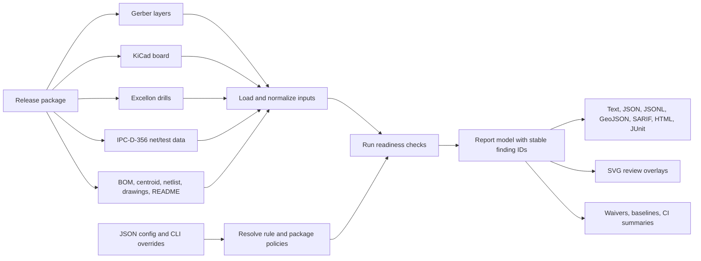

<h1>
  hyperdrc
  
</h1>

`hyperdrc` is a Rust library and thin command line tool for PCB
design-readiness checks over Gerber, KiCad, Excellon, and IPC-D-356 inputs. It
uses the latest git version of [`csgrs`](https://github.com/timschmidt/csgrs)
for Gerber parsing, polygon offsets, and boolean geometry.

## Current Status

`hyperdrc` is an active prototype with a broad regression suite for
fabrication-readiness rules. It supports layer-level Gerber checks, net-aware
KiCad checks, Excellon drill sidecars, IPC-D-356 electrical-test sidecars,
JSON/JSON Lines/GeoJSON/SARIF/HTML/JUnit/text reports, GitHub Actions
annotations, SVG review overlays, JSON waivers, JSON rule configuration,
TransJLC conversion, Gerber-directory sidecar discovery, and structured input
provenance with parser diagnostics, including initial Gerber X2 metadata
diagnostics for image setup, manifest-driving file attributes,
image polarity and transforms, interpolation and quadrant modes, region mode,
step-and-repeat, aperture macros, aperture definitions and use,
coordinate-operation evidence, aperture-function intent, object-level
net/component/pin intent, and attribute-delete evidence.

The implemented checks are useful for CI and local design review, but they are
not a replacement for a fabricator's final DFM/DRC pass. Some geometry and
electrical intent remains conservative: KiCad oval and rectangular drill declarations are treated as
circular keepouts using their larger dimension until exact routed-slot geometry
is modeled, config-driven impedance checks combine stackup/reference metadata
review with first-pass single-ended outer-layer microstrip estimates only when
stackup data is complete, plus centered stripline estimates when adjacent
reference spacing is symmetric enough to avoid guessing, and IPC-D-356 parsing
focuses on common test records, recognized record-code counts, and optional
access-side/feature/soldermask hints plus report-level metadata summaries
and net/reference/pin/diameter/geometry summaries rather than the full
fixed-column dialect.

## Project Choices

`hyperdrc` is built as a readiness reviewer, not as a CAD database or a
fabricator-certified CAM engine. The project deliberately favors checks that
make release-package risk visible before upload: missing sidecars, ambiguous
intent, geometry that is probably manufacturable only by luck, and inconsistencies
between KiCad, Gerber, drill, test, BOM, and handoff notes.

Several design decisions follow from that goal:

- The library is the product boundary. The CLI is thin so CI jobs, custom
  release tooling, and tests can all use the same `run` pipeline and report
  model.
- Findings are conservative review prompts. A warning means "review this before
  release", not "the board is impossible to build".
- Parser diagnostics are first-class report data. Malformed or incomplete sidecar
  records are preserved as structured evidence instead of being hidden behind a
  single parse failure.
- Geometry is normalized to polygons and point features, while source-specific
  intent stays attached in side models. This lets Gerber-only, KiCad-aware,
  Excellon-aware, and IPC-D-356-aware checks share enough infrastructure without
  pretending those formats carry the same information.
- Configuration is explicit and auditable. Rule decks, package profiles,
  assembly profiles, stackup metadata, waivers, and baselines are intended to be
  committed beside the design and reviewed like other release artifacts.

## Workflow Overview



## Core Concepts

- **Input manifest**: the list of loaded files, their roles, parser provenance,
  and conversion origin. Manifest checks use this to catch incomplete or
  contradictory manufacturing packages.
- **Parser diagnostic**: non-fatal evidence that an input was present but partly
  malformed, unsupported, or ambiguous. Diagnostics travel in the report beside
  DRC findings.
- **Violation**: a review finding with stable ID, severity, check name, layer or
  source context, message, and optional geometry. Violations are the objects
  waivers, baselines, CI summaries, JSON, SARIF, HTML, and SVG overlays consume.
- **Readiness check**: a rule that asks whether the package is ready for a
  manufacturing or assembly review step. Many checks are intentionally about
  missing evidence, inconsistent metadata, or risky intent rather than exact
  copper-collision geometry.
- **Sidecar**: a non-Gerber manufacturing artifact such as Excellon drill files,
  IPC-D-356 electrical-test data, BOMs, centroids, netlists, drawings, and README
  handoff notes.
- **Policy layer**: JSON configuration and CLI overrides that describe project
  choices such as required artifacts, package profile, assembly profile, stackup,
  net classes, voltage/current limits, and waiver governance.

## Library And CLI Split

The reusable API lives in `src/lib.rs`. It exposes parser modules, check
modules, report types, rule policy modules, and the crate-root `run` entry
point. `run` returns a `RunOutcome` containing the serializable `Report` instead
of terminating the process, so Rust callers can embed `hyperdrc` in services,
tests, or custom CI tooling.

The binary in `src/main.rs` is intentionally thin: it parses `Cli` with `clap`
and calls `hyperdrc::run_cli`, which delegates to the library and then maps
active findings to the traditional non-zero process exit status. Use
`--allow-findings` for exploratory or report-only automation that should emit
the full report and still return exit code 0 when findings remain.

## Quick Start

Run all default checks against one or more Gerber layers:

```sh
cargo run -- path/to/top.gbr path/to/bottom.gbr
```

Load every Gerber-like file from a directory. The same directory is also scanned
for common Excellon, IPC-D-356, BOM, centroid, netlist, README, fabrication
drawing, assembly drawing, and rout/panel drawing sidecars:

```sh
cargo run -- --gerber-dir path/to/gerber-package
```

Include pre-production sidecars for manifest-driven readiness checks:

```sh
cargo run -- \
  --check file-manifest-readiness \
  --package-archive release-package.zip \
  --bom parts.csv \
  --centroid placement.txt \
  --netlist netlist.csv \
  --fab-drawing fab.dxf \
  --assembly-drawing assembly.dxf \
  --readme release-notes.md \
  --rout-drawing panel.dxf \
  --declared-copper-layer-count 4 \
  --kicad-pcb board.kicad_pcb \
  --excellon board.drl \
  top.gbr \
  bottom.gbr
```

Convert a Gerber package with
[`TransJLC`](https://github.com/HalfSweet/TransJLC) before loading the converted
outputs, or export Gerbers directly from a KiCad board with `kicad-cli`:

```sh
cargo run -- \
  --convert-input path/to/source-gerbers \
  --conversion-output-dir build/hyperdrc-converted \
  --source-eda kicad \
  --transjlc-bin TransJLC \
  --conversion-arg --colorize \
  --conversion-arg --zip-name=upload
```

```sh
cargo run -- \
  --convert-input board.kicad_pcb \
  --converter kicad-cli \
  --kicad-cli-bin kicad-cli \
  --conversion-output-dir build/hyperdrc-kicad-gerbers \
  --conversion-arg --layers \
  --conversion-arg F.Cu,B.Cu \
  --kicad-cli-drill-arg --generate-map \
  --kicad-cli-pos-arg --smd-only \
  --kicad-cli-handoff-exports \
  --kicad-cli-review-exports
```

The KiCad CLI backend exports Gerbers, Excellon drill files, and a CSV
`positions.pos` placement file into the conversion output directory, plus an
IPC-D-356 test netlist at `ipc356.d356` and a JSON DRC report at
`kicad_drc.json`. With `--kicad-cli-review-exports`, it also writes DXF, SVG,
and PDF review drawings with sidecar-friendly filenames.
With `--kicad-cli-handoff-exports`, it also writes IPC-2581, ODB++, STEP, GLB,
PLY, and JSON statistics handoff outputs into the conversion directory.
Converted drill, IPC-D-356, placement, and drawing files are discovered as
sidecars and feed the same Excellon, drill-readiness, IPC-D-356, centroid,
drawing, and artifact checks as explicit `--excellon`, `--ipc356`,
`--centroid`, `--fab-drawing`, and `--assembly-drawing` inputs. Converted KiCad
DRC JSON entries are surfaced as report diagnostics. Converted IPC-2581,
GenCAD, boundary-scan, flying-probe, AOI/ICT, ODB++, STEP/STEPZ, mesh outputs,
and visual review images are preserved as manufacturing handoff sidecars;
IPC-2581 XML, GenCAD text, KiCad statistics JSON, STEP text, mechanical mesh
files, PNG/JPEG/TIFF/BMP/WebP image headers, and test/inspection reports get
lightweight parser-evidence diagnostics, including STL/OBJ/PLY/GLB/glTF mesh
summaries, SVF/JTAG boundary-scan command summaries, and tester-report
table/column evidence, while ODB++ is recorded as present pending a full
importer.
IPC-2581 diagnostics include XML section evidence plus common layer, net,
refdes, package, drill, coordinate, and unit attributes when present.
ODB++ diagnostics inspect ZIP/TAR/TGZ or directory package trees for matrix,
step, layer, feature, profile, netlist, component/EDA, and drill/tool evidence
without importing proprietary geometry.

Drawing sidecar discovery accepts common CAD/review outputs for fabrication,
assembly, and rout/panel review, including PDF, DXF/DXB, SVG, DWG, ACIS/SAT,
PS/EPS, PLT, and HPGL/HPG where the filename declares the drawing role.
SVG drawings get XML element summaries, DXF drawings get section/entity
summaries, PDF/PostScript/HPGL and raster drawings get lightweight header or
command evidence, and binary CAD drawings are retained in the manifest with an
explicit parser diagnostic.

Run KiCad-aware checks against a `.kicad_pcb` file:

```sh
cargo run -- \
  --config examples/hyperdrc-config.json \
  --kicad-pcb board.kicad_pcb \
  --kicad-copper-layer F.Cu \
  --kicad-copper-layer B.Cu \
  --excellon panel-holes.drl \
  --ipc356 board.ipc \
  --format geojson
```

Generate a release report without failing the surrounding shell recipe on
findings:

```sh
cargo run -- \
  --allow-findings \
  --kicad-pcb board.kicad_pcb \
  --format geojson
```

Run a specific check sequence:

```sh
cargo run -- \
  --check mask-island-keepout \
  --check copper-overlap \
  --keepout 0.2 \
  --pair 0:1 \
  --format json \
  path/to/mask.gbr path/to/copper.gbr
```

Layer roles can be inferred from standard Gerber extensions, common KiCad-style
layer names, and X2 `.FileFunction` attributes. Explicit zero-based indexes are
still available and override inferred roles for ambiguous packages:

```sh
cargo run -- \
  --board-outline 2 \
  --copper-layer 0 \
  --copper-layer 1 \
  --paste-pair 3:0 \
  --mask-pair 0:4 \
  --silk-layer 5 \
  --silk-pair 5:4 \
  top.gbr bottom.gbr edge.gbr paste.gbr mask.gbr silk.gbr
```

Output formats are `text`, `json`, `jsonl`, `geojson`, `sarif`,
`github-annotations`, `html`, and `junit`. JSON reports include stable violation
IDs, severity, layers, polygon coordinates, point locations where applicable,
short messages, structured parser diagnostics, and a structured input manifest.
Parser diagnostics cover Gerber metadata/image-syntax evidence, Excellon,
IPC-D-356, KiCad CLI DRC JSON, IPC-2581/GenCAD/test-inspection/ODB++/KiCad-statistics/STEP/mesh/image handoff evidence,
BOM/centroid/netlist table parser issues, and converter output manifest issues.
JSON sidecars can be direct tables or nested
objects containing common table arrays; nested JSON cells are flattened into
dotted column names. Spreadsheet sidecars extract matching-header rows across
multiple populated workbook sheets; `--bom-sheet`, `--centroid-sheet`, and
`--netlist-sheet` can select named workbook tabs when the release table is not
the first populated sheet, merging selected tabs by normalized header union when
they describe related auxiliary data with different columns. Spreadsheet sidecars also emit diagnostics for
formula cells, defined names, VBA/macro projects, hidden sheets, multiple populated
sheets, merged regions, native Excel tables, custom number formats, cell
styles, conditional formatting, data validations, autofilters, cell error
values, hyperlinks, comments, drawing objects, embedded media, charts, pivot
tables, and date/time conversion caveats. Formula cells are also preserved in
the extracted text as ignored `# hyperdrc-workbook-formula` metadata comments.
During a run, `hyperdrc` writes start/end status lines for runtime phases and
per-check execution to stderr with elapsed time; each completed check also
reports its new finding count. Expensive checks such as minimum copper neck,
mask sliver, aperture/opening spacing, drill-to-copper clearance, and net
spacing also emit intra-check progress lines so long-running layer or board
work can be monitored. This leaves stdout safe for the selected report format.
JSON Lines emits one run/input/diagnostic/violation object per line for
streaming analytics. `--sqlite-report report.sqlite` writes a queryable SQLite
database with summary, input, diagnostic, active finding, and waived finding
tables, and `--arrow-report report.arrow` writes the same report model as an
Arrow IPC file for columnar analytics. `--parquet-report report.parquet` writes
the same schema as a Parquet file for warehouse ingestion. SARIF output
preserves stable hyperdrc finding IDs and PCB geometry in result properties for
CI/code-review systems. GitHub annotation output emits workflow commands that
surface findings in Actions logs. HTML
output embeds the SVG overlay with summary, parser diagnostic, input, and
finding tables for review packets. JUnit XML output maps active findings into
testcase failures for CI systems with JUnit publishers. SVG review overlays can
be written with `--svg-overlay violations.svg`.
Active-finding waiver stubs and baselines can be written with `--waiver-stubs
waiver-stubs.json` and `--baseline-file baseline.json`. A current run can also
be compared to a saved baseline with `--baseline-reference previous.json` and
`--baseline-diff-file baseline-diff.json`, producing new, resolved, and unchanged
finding buckets for release review.

Rule thresholds can be placed in a JSON config file and loaded with `--config`.
CLI flags override config values. See
[examples/hyperdrc-config.json](examples/hyperdrc-config.json).
The config also tunes package policy. `package_profile` accepts
`full-production`, `fabrication-only`, `assembly-only`, or `electrical-test`;
that profile sets default manifest expectations, and `required_artifacts` plus
`required_layers` can override individual deliverables. Generated-output
freshness is controlled with `generated_date_stale_days`. Assembly thresholds
can be selected with `assembly_profile` (`prototype`, `production-smt`,
`double-sided-smt`, `test-fixture`, `hand-assembly`, `selective-solder`,
`wave-solder`, `press-fit`, or `conformal-coating`) and tuned field-by-field in
`assembly`.
Stackup readiness accepts process metadata plus built-in or custom
`fabrication_capability` thresholds for finished thickness, copper layer count,
copper weight, dielectric thickness, laminate Dk/Df, and Tg. Built-in
fabricator profiles include generic `prototype-fab`, `standard-fab`, and
`advanced-fab` decks plus vendor-style `jlcpcb-economy`, `jlcpcb-standard`,
`jlcpcb-advanced`, `pcbway-standard`, `pcbway-advanced`,
`eurocircuits-pcb-proto`, `eurocircuits-standard-pool`, and
`eurocircuits-defined-impedance` service classes. Profiles can distinguish hard
limits, preferred service limits, and cost-escalation review thresholds.

## Readiness Coverage

The default suite covers the main `hyperdrc` readiness surfaces:

- Layer geometry: copper overlap with optional IPC-D-356 same-net/mixed-net
  evidence classification, edge clearance, mask and paste alignment,
  silkscreen clearance, minimum feature width, independently selectable polygon
  and trace-junction acid traps, whole-layer copper balance, first-class local
  copper-density balance, and board-outline sanity.
- Drill and fabrication context: annular ring, drill spacing, drill-to-copper
  clearance, routed-slot readiness, castellation intent, aspect ratio,
  Excellon M48/%/M30 program-structure evidence, M71/M72 unit command support,
  unit-declaration summaries, tool-table summaries, routing-command summaries, drill-hit and drill-geometry summaries,
  IPC-D-356 record/field/geometry/diagnostic summaries, unit/zero-suppression/tool/routing-command diagnostics, duplicate drill-geometry, drill-diameter outlier,
  plated/non-plated split review, and cross-source drill-table consistency.
- KiCad board context: net intent, high-speed and high-current heuristics,
  reference-plane, split-plane, and return-proximity coverage, RF keepout, antenna copper-free
  region, and via-fence review, gold fingers, ESD proximity and TVS clamp
  return-path proximity, bucketed voltage/protective-earth spacing, bucketed ESD protection/return, surge-protection keepouts, panelization clearance, mounting-hole grounding,
  plating, edge-clearance, distribution, spacing, copper-keepout review,
  same-net drill-break continuity review, different-net short isolation review,
  differential pair width, neck-down, skew, via proximity/return, and pair-to-pair spacing review,
  high-current pad-entry and via-return support review,
  switch-node and inductor copper keepouts, panel-feature
  outline registration review, edge-plating intent, castellation pitch,
  component edge/hole clearance, dense-pad escape, pad/via spacing,
  mask-bridge review, bucketed thermal copper-area/spacing/keepout review, thermal-via count/distribution, and config-driven
  stackup/net-class constraints for material, surface finish,
  laminate Dk/Df/Tg, soldermask process/color, IPC/fabricator class,
  fabrication capability thresholds, width, clearance, current, voltage,
  reference-plane, layer-count, via-count, approximate length/skew,
  differential-pair spacing, differential-pair return/guard proximity,
  mixed-signal partitioning, inherited net-class policy defaults,
  rectangular region-scoped net-class rules, and
  impedance-control target/tolerance intent with first-pass single-ended
  outer-layer microstrip and centered stripline estimates where stackup data
  supports them.
  Companion checks for thermal-via distribution, bucketed thermal copper-area/spacing/keepout review, bucketed RF/antenna keepout,
  RF via-fence, TVS/ESD return path, bucketed switch-node and inductor copper keepout, bucketed sensitive-net/mixed-signal partitioning, and
  dense-pad via/mask review are also first-class CLI checks rather than only
  hidden side effects of broader review groups.
- Assembly and test readiness: profile-driven component edge and bucketed hole/spacing
  clearance, bucketed connector rework spacing, fiducials and fiducial copper
  keepouts with nearby-blocker bucketing, tooling holes, mouse bites, testpoint coverage/accessibility
  including IPC-D-356 access-side, soldermask, KiCad pad-side parity hints,
  bucketed component/probe spacing review, testpoint copper clearance, bucketed
  pad-pair asymmetry, dense-pad escape, bucketed selective/wave solder and
  press-fit keepouts, conformal-coating keepouts, and IPC-D-356 coverage.
- Production package readiness: Gerber package completeness, sidecar discovery,
  BOM/centroid/netlist structure, README release notes, fabrication and assembly
  drawings, rout drawings, order-parameter consistency, generated-date freshness,
  duplicate layer/island-geometry detection, tiny and skinny layer-fragment
  detection, Gerber X2 Part/FileFunction/FilePolarity layer-role metadata
  including structural FileFunction role-field validation and partial/mixed
  FilePolarity evidence review,
  SameCoordinates alignment-evidence consistency, CreationDate freshness and
  FileFunction/GenerationSoftware/ProjectId provenance checks, Gerber source
  unit reporting and image unit/coordinate-format consistency,
  MD5 checksum-evidence coverage, negative-copper-polarity review,
  side-role filename conflict detection, paste/mask companion checks
  including solder-mask opening-ratio, annular-ring relief, and silkscreen
  text-height review,
  filename layer-count convention parity, configurable required artifacts/layers, centroid unit/origin/rotation
  convention handoff with KiCad `.pos`, Altium placement CSV, JLCPCB CPL, and
  generic centroid schema aliases, BOM compliance/traceability/source-control evidence for
  sensitive rows, package-level polarity/MSL handoffs, polarized same-package
  centroid orientation review, dense-package reflow-profile handoff,
  tall-component height/keepout handoff, thermal-validation handoff for
  heat-dissipating rows, low-standoff cleanliness handoff, press-fit and
  wire-bond process/drawing handoff, fabrication marking-zone handoff,
  preflight overlay and waiver/baseline diff evidence, conditional
  engineering-review-packet completeness, and surface-finish handoff notes.

The check implementations and exact ownership are documented in
[src/checks](src/checks/README.md). The roadmap and remaining gaps are tracked
in [docs/design-readiness-plan.md](docs/design-readiness-plan.md).

Important tunables include `--keepout`, `--clearance`, `--min-width`,
`--min-mask-width`, `--min-solder-mask-annular-ring`,
`--min-solder-mask-opening-area-ratio`,
`--max-solder-mask-opening-area-ratio`, `--min-silkscreen-text-height`,
`--acid-trap-angle`, `--annular-ring`,
`--drill-clearance`, `--board-thickness`, `--max-drill-aspect-ratio`,
`--min-paste-area-ratio`, `--max-paste-area-ratio`, `--stencil-thickness`,
`--min-stencil-area-ratio`, `--max-copper-imbalance-ratio`, `--net-clearance`,
`--registration-tolerance`, `--panel-clearance`, `--ipc356-tolerance`,
`--min-area`, `--max-layer-area`, and `--generated-date-stale-days`.

## Waivers And CI

Waiver files are JSON and can suppress findings by `id`, `check`, `layers`, and
message text. The default suite includes `waiver-governance`, and it can also be
selected explicitly; it emits readiness warnings for incomplete waiver metadata
so production waivers remain auditable: `reason`, `owner`, `review_date`,
`source`, and `geometry_hash` are expected. `review_date` must be an ISO
`YYYY-MM-DD` date and is warned when it has expired, so standing exceptions stay
visible in pre-production review. A compact CI summary can be written with
`--summary-file`. SVG overlays can be written with `--svg-overlay`, and Gerber
review overlays can be written with `--gerber-overlay` for loading active
finding geometry in board or CAM viewers, `--gerber-keepout-overlay` can emit a
Gerber keepout review layer, Excellon-style marker overlays can be written with
`--excellon-overlay` for drill-map review, and DXF overlays can be written with
`--dxf-overlay` for CAD/mechanical review. PDF overlays can be written with
`--pdf-overlay` for document-centric review packets. KiCad custom-rule decks can
be generated with `--kicad-dru-output` for early editor feedback on core
clearance, width, annular-ring, board-edge, silkscreen, and hole-clearance
thresholds; `--kicad-dru-merge-input` and `--kicad-dru-merge-output` write a
copy of an existing project rule file with HyperDRC rules inserted between
generated markers. Standalone KiCad review-marker boards can be generated with
`--kicad-marker-output`; `--kicad-marker-merge-output` writes a marked-up copy
of the first input `.kicad_pcb` with HyperDRC user layers and active finding
geometry inserted, without modifying the source board. IPC-D-356 electrical-test
review companions can be written with
`--ipc356-review-output`; they summarize parsed test access by source and net
and annotate active drill/net/test-related findings, including a stable
key-value `DIFF_*` comment block for scripts that need machine-readable review
context. GenCAD-style DFT review
companions can be written with `--gencad-review-output`; they include sectioned
summary data, IPC-D-356-derived net names, component references, testpin records,
and active/waived fixture/manufacturing findings for test engineering review. IPC-2581-style XML manufacturing review
companions can be written with `--ipc2581-review-output`; they embed HyperDRC
DRC/DFM annotations, locations, and region summaries for CAM handoff review.
HTML reports retain waived finding details and provide active/waived filters for review. Proposed waiver stubs and active-finding baselines can be generated without suppressing
anything. Baseline comparison is an audit artifact: it classifies drift in the
active finding set, but waivers remain the mechanism for intentionally
suppressing accepted findings.

```json
{
  "waivers": [
    {
      "check": "acid-trap-candidate",
      "layers": ["F.Cu"],
      "message_contains": "below 30",
      "reason": "accepted connector footprint geometry",
      "owner": "DRC reviewer",
      "review_date": "2027-05-01",
      "source": "https://jira.example/issues/123",
      "geometry_hash": "hyperdrc-geometry-v1:0123456789abcdef"
    }
  ]
}
```

```sh
cargo run -- \
  --kicad-pcb board.kicad_pcb \
  --waiver waivers.json \
  --summary-file summary.json \
  --svg-overlay violations.svg \
  --waiver-stubs waiver-stubs.json \
  --baseline-file baseline.json \
  --baseline-reference previous-baseline.json \
  --baseline-diff-file baseline-diff.json
```

## Repository Map

Each folder has its own local README with the hyperdrc-specific ownership
details for that part of the tree:

- [src](src/README.md): Rust crate structure, runtime pipeline, parsers,
  reports, configuration, and submodule map.
- [src/checks](src/checks/README.md): all design-readiness checks grouped by
  layer, drill, board, mechanical, stencil, assembly, manifest, artifact,
  surface-finish, and helper responsibilities.
- [src/geometry](src/geometry/README.md): polygon construction, sketch
  conversion, shape extraction, and geometry-test expectations.
- [src/kicad](src/kicad/README.md): KiCad board model, S-expression parsing,
  graphics parsing, and current parser scope.
- [docs](docs/README.md): roadmap, design-readiness backlog, and visual assets.
- [docs/testing.md](docs/testing.md): test-suite guide explaining what the
  current tests look for and how they exercise `hyperdrc`.
- [examples](examples/README.md): runnable configuration examples.
- [benches](benches/README.md): benchmark and smoke-performance entry points.
- [proptest-regressions](proptest-regressions/README.md): persisted fuzz and
  property-test regression seeds.

## Known Gaps

Not yet modeled: exact routed slot shapes, plated-slot/edge-plating electrical
semantics, subtractive KiCad custom pad primitive booleans, glyph-accurate
KiCad silkscreen text rendering and side/mirroring, per-pad paste or mask
attributes, fabricator-specific rule-deck libraries,
asymmetric-stripline/coupled/coplanar/vendor-tuned impedance solving, routed
differential-pair length/skew matching, schema-specific nested JSON sidecar
dialects, workbook-aware formulas/styles/macros for spreadsheets, richer parser
diagnostics for all input formats, and ODB++/IPC-2581 input.

See [docs/design-readiness-plan.md](docs/design-readiness-plan.md) for the
long-form design-readiness roadmap.

## References

hyperdrc comments and readiness heuristics cite these design and manufacturing
references where the code implements related checks. Entries are kept in MLA
style so they can be copied into engineering review notes.

- Areny, F. A., et al. "A Study of SnAgCu Solder Paste Transfer Efficiency and Effects of Optimal Reflow Profile on Solder Deposits." *Microelectronic Engineering*, 2011, https://doi.org/10.1016/j.mee.2011.02.104.
- Andrew, A. M. "Another Efficient Algorithm for Convex Hulls in Two Dimensions." *Information Processing Letters*, vol. 9, no. 5, 1979, pp. 216-219, https://doi.org/10.1016/0020-0190(79)90072-3.
- Becerra, Jose, Dennis Willie, and Murad Kurwa. "Press Fit Technology Roadmap and Control Parameters for a High Performance Process." *IPC APEX EXPO Conference Proceedings*, Flextronics, https://www.circuitinsight.com/pdf/press_fit_technology_roadmap_control_parameters_ipc.pdf. Accessed 14 May 2026.
- Bentley, Jon Louis. "Multidimensional Binary Search Trees Used for Associative Searching." *Communications of the ACM*, vol. 18, no. 9, 1975, pp. 509-517, https://doi.org/10.1145/361002.361007.
- Bhargava, Ankit, et al. "DC-DC Buck Converter EMI Reduction Using PCB Layout Modification." *IEEE Transactions on Electromagnetic Compatibility*, vol. 53, no. 3, 2011, pp. 806-813, https://doi.org/10.1109/TEMC.2011.2145421.
- Black, J. R. "Electromigration--A Brief Survey and Some Recent Results." *IEEE Transactions on Electron Devices*, vol. 16, no. 4, 1969, pp. 338-347, https://doi.org/10.1109/T-ED.1969.16754.
- Chen, Fen, and Ning-Cheng Lee. "A Novel Solution for No-Clean Flux Not Fully Dried Under Component Terminations." *Indium Corporation Technical Paper*, 2015, https://www.electronics.org/system/files/technical_resource/E39%26S13_03%20-%20Ning%20C.%20Lee.pdf. Accessed 14 May 2026.
- Chesser, Kevin, and May Porley. "What Are the Basic Guidelines for Layout Design of Mixed-Signal PCBs?" *Analog Dialogue*, vol. 56, no. 3, 2022, https://www.analog.com/en/resources/analog-dialogue/articles/what-are-the-basic-guidelines-for-layout-design-of-mixed-signal-pcbs.html. Accessed 14 May 2026.
- Cohn, S. B. "Characteristic Impedance of the Shielded-Strip Transmission Line." *IRE Transactions on Microwave Theory and Techniques*, vol. MTT-2, no. 2, 1954, pp. 52-57, https://doi.org/10.1109/TMTT.1954.1124875.
- Eurocircuits. "Tombstoning." *Eurocircuits Technical Guidelines*, https://www.eurocircuits.com/technical-guidelines/pcb-assembly-guidelines/tombstoning/. Accessed 13 May 2026.
- Ericson, Christer. *Real-Time Collision Detection*. CRC Press, 2005.
- Farin, Gerald. *Curves and Surfaces for CAGD: A Practical Guide*. 5th ed., Academic Press, 2002.
- FixturFab. "Design for Test: How to Design Test Points for PCB Testing." *FixturFab Resources*, https://fixturfab.com/resources/how-to-test/design-for-test. Accessed 13 May 2026.
- GitHub. "Workflow Commands for GitHub Actions." *GitHub Docs*, https://docs.github.com/en/actions/reference/workflows-and-actions/workflow-commands. Accessed 13 May 2026.
- Hammerstad, E., and O. Jensen. "Accurate Models for Microstrip Computer-Aided Design." *1980 IEEE MTT-S International Microwave Symposium Digest*, 1980, pp. 407-409, https://doi.org/10.1109/MWSYM.1980.1124303.
- Harter, Stefan, et al. "The Effect of Area Shape and Area Ratio on Solder Paste Printing Performance." *SMTA International*, 2016, https://www.circuitnet.com/programs/55115.html.
- Hinnant, Howard. "chrono-Compatible Low-Level Date Algorithms." *Howard Hinnant's Date Algorithms*, https://howardhinnant.github.io/date_algorithms.html. Accessed 13 May 2026.
- Hollstein, K., X. Yang, and K. Weide-Zaage. "Thermal Analysis of the Design Parameters of a QFN Package Soldered on a PCB Using a Simulation Approach." *Microelectronics Reliability*, vol. 120, 2021, article 114118, https://doi.org/10.1016/j.microrel.2021.114118.
- IPC. *Generic Standard on Printed Board Design: IPC-2221B*. IPC, https://www.ipc.org/TOC/IPC-2221B.pdf. Accessed 13 May 2026.
- IPC. *Standard for Determining Current Carrying Capacity in Printed Board Design: IPC-2152*. IPC, 2009, https://shop.ipc.org/ipc-2152/ipc-2152-standard-only.
- IPC. *Bare Substrate Electrical Test Data Format: IPC-D-356B*. IPC, 1 Oct. 2002, https://shop.electronics.org/ipc-d-356/ipc-d-356-standard-only.
- IPC. *Computer Numerical Control Formatting for Drillers and Routers: IPC-NC-349*. IPC, 1985, https://www.electronics.org/TOC/IPC-NC-349.pdf. Accessed 16 May 2026.
- IPC. *Generic Requirements for Surface Mount Design and Land Pattern Standard: IPC-7351B*. IPC, 2010, https://shop.ipc.org/ipc-7351/ipc-7351-standard-only.
- KiCad. "S-Expression Format." *KiCad Developer Documentation*, https://dev-docs.kicad.org/en/file-formats/sexpr-intro/. Accessed 15 May 2026.
- IEC. *IEC 60352-5: Solderless Connections, Part 5: Press-In Connections, General Requirements, Test Methods and Practical Guidance*. International Electrotechnical Commission, https://webstore.iec.ch/publication/23286.
- IEC. *IEC 61000-4-5: Electromagnetic Compatibility (EMC), Part 4-5: Testing and Measurement Techniques, Surge Immunity Test*. International Electrotechnical Commission, https://webstore.iec.ch/publication/4184.
- IEEE. *IEEE Standard for Configuration Management in Systems and Software Engineering: IEEE Std 828-2012*. IEEE, 2012, https://doi.org/10.1109/IEEESTD.2012.6170935.
- IPC. *Press-Fit Standard for Automotive Requirements and Other High-Reliability Applications: IPC-9797*. IPC, May 2020, https://www.ipc.org/TOC/IPC-9797-toc.pdf.
- IPC. *Requirements for Soldered Electrical and Electronic Assemblies: IPC J-STD-001H*. IPC, Sept. 2020, https://shop.ipc.org/ipc-j-std-001/ipc-j-std-001-standard-only.
- IPC. *Requirements for Electrical Testing of Unpopulated Printed Boards: IPC-9252B*. IPC, 2016, https://shop.ipc.org/ipc-9252/ipc-9252-standard-only.
- IPC. *Guidelines for Temperature Profiling for Mass Soldering Processes (Reflow and Wave): IPC-7530*. IPC, https://shop.ipc.org/ipc-7530/ipc-7530-standard-only.
- IPC. *Performance Specification for Electroless Nickel/Immersion Gold (ENIG) Plating for Printed Boards: IPC-4552B*. IPC, Apr. 2021, https://www.ipc.org/TOC/IPC-4552B-toc.pdf.
- IPC. *Qualification and Performance Specification for Rigid Printed Boards: IPC-6012D*. IPC, https://www.ipc.org/TOC/IPC-6012D.pdf. Accessed 13 May 2026.
- IPC. *Specification for Electroless Nickel/Electroless Palladium/Immersion Gold (ENEPIG) Plating for Printed Circuit Boards: IPC-4556*. IPC, 5 Feb. 2013, https://shop.electronics.org/ipc-4556/ipc-4556-standard-only/Revision-0/english.
- Ucamco. *The Gerber Layer Format Specification, Revision 2024.05*. Ucamco NV, 2024, https://www.ucamco.com/en/gerber/downloads. Accessed 16 May 2026.
- IPC. *Specification for Immersion Silver Plating for Printed Boards: IPC-4553A*. IPC, 16 June 2009, https://webstore.ansi.org/standards/ipc/ipc4553a2009.
- IPC. *Stencil Design Guidelines: IPC-7525B*. IPC, https://www.ipc.org/TOC/IPC-7525B.pdf. Accessed 13 May 2026.
- Kirschning, M., and R. H. Jansen. "Accurate Wide-Range Design Equations for the Frequency-Dependent Characteristic of Parallel Coupled Microstrip Lines." *IEEE Transactions on Microwave Theory and Techniques*, vol. 32, no. 1, 1984, pp. 83-90, https://doi.org/10.1109/TMTT.1984.1132616.
- Oezkoek, Mustafa, Joe McGurran, Dieter Metzger, and Hugh Roberts. "Wire Bonding and Soldering on ENEPIG and ENEP Surface Finishes with Pure Pd-Layers." *IPC Technical Resource*, Atotech, https://www.ipc.org/system/files/technical_resource/E5%26S34_01.pdf. Accessed 15 May 2026.
- Parnas, D. L. "On the Criteria To Be Used in Decomposing Systems into Modules." *Communications of the ACM*, vol. 15, no. 12, 1972, pp. 1053-1058, https://doi.org/10.1145/361598.361623.
- Paterson, Donald G., and Miles A. Tinker. "Studies of Typographical Factors Influencing Speed of Reading. II. Size of Type." *Journal of Applied Psychology*, vol. 13, no. 2, 1929, pp. 120-130, https://doi.org/10.1037/h0074167.
- Chin, Cheng-Hao, and Gnyaneshwar Ramakrishna. "Impact of BGA Escape Trace Design on Performance of Solder Joint." *SMTA International*, Cisco Systems, https://www.circuitnet.com/programs/56311.html. Accessed 14 May 2026.
- Jonnalagadda, K. "Reliability of Via-in-Pad Structures in Mechanical Cycling Fatigue." *Microelectronics Reliability*, vol. 42, no. 2, 2002, pp. 253-258, https://doi.org/10.1016/S0026-2714(01)00136-6.
- Lee, Jae-Hun, et al. "Effect of Pulse-Reverse Plating on Copper: Thermal Mechanical Properties and Microstructure Relationship." *Microelectronics Reliability*, vols. 100-101, 2019, article 113383, https://doi.org/10.1016/j.microrel.2019.06.062.
- Lee, D. T., and Franco P. Preparata. "Computational Geometry - A Survey." *IEEE Transactions on Computers*, vol. C-33, no. 12, 1984, pp. 1072-1101, https://doi.org/10.1109/TC.1984.1676388.
- Lin, Ming C., and John F. Canny. "A Fast Algorithm for Incremental Distance Calculation." *Proceedings. 1991 IEEE International Conference on Robotics and Automation*, 1991, pp. 1008-1014, https://doi.org/10.1109/ROBOT.1991.131723.
- OASIS. *Static Analysis Results Interchange Format (SARIF) Version 2.1.0*. Edited by Michael C. Fanning and Laurence J. Golding, OASIS Committee Specification 01, 23 July 2019, https://docs.oasis-open.org/sarif/sarif/v2.1.0/cs01/sarif-v2.1.0-cs01.html.
- STMicroelectronics. *AN576: Influence of the PCB Layout on the ESD Protection*. STMicroelectronics, DocID3588 Rev. 3, https://www.st.com/resource/en/application_note/an576-pcb-layout-optimisation-stmicroelectronics.pdf. Accessed 14 May 2026.
- Sun, Yanhui, et al. "Multi-Physics Coupling Aid Uniformity Improvement in Pattern Plating." *Applied Thermal Engineering*, vol. 108, 2016, pp. 1197-1206, https://doi.org/10.1016/j.applthermaleng.2016.07.182.
- Tang, Yinggang, et al. "Study on Wet Chemical Etching of Flexible Printed Circuit Board with 16-um Line Pitch." *Journal of Electronic Materials*, vol. 52, 2023, pp. 4030-4036, https://doi.org/10.1007/s11664-023-10368-z.
- Toussaint, Godfried T. "Solving Geometric Problems with the Rotating Calipers." *Proceedings of IEEE MELECON '83*, 1983.
- Wilcoxon, Ross, Tim Pearson, and David Hillman. "Modeling the Effects of Thermal Pad Voiding on Quad Flatpack No-Lead (QFN) Components." *Journal of Surface Mount Technology*, vol. 36, no. 2, 2023, https://doi.org/10.37665/smt.v36i2.37.
- Wheeler, H. A. "Transmission-Line Properties of a Stripline Between Parallel Planes." *IEEE Transactions on Microwave Theory and Techniques*, vol. 26, no. 11, 1978, pp. 866-876, https://doi.org/10.1109/TMTT.1978.1129505.
- Wong, Hang, et al. "Small Antennas in Wireless Communications." *Proceedings of the IEEE*, vol. 100, no. 7, 2012, pp. 2109-2121, https://doi.org/10.1109/JPROC.2012.2188089.
- Xu, Jun, and Shuo Wang. "Investigating a Guard Trace Ring to Suppress the Crosstalk Due to a Clock Trace on a Power Electronics DSP Control Board." *IEEE Transactions on Electromagnetic Compatibility*, vol. 57, no. 3, 2015, pp. 546-554, https://doi.org/10.1109/TEMC.2015.2403289.
