# hyperdrc Checks

This folder contains the design-readiness checks that turn parsed geometry,
board context, and sidecar data into `hyperdrc` violations. Checks are grouped
by the data model they need.

## Module Map

- [`mod.rs`](mod.rs) exposes the check modules and documents the broad grouping.
- [`layer.rs`](layer.rs) contains checks over already-flattened 2D layer
  geometry, whether that geometry came from Gerber or from KiCad copper
  aggregation.
- [`drill.rs`](drill.rs) contains hole, slot, castellation, drill-spacing,
  drill-to-copper, annular-ring, aspect-ratio, and drill-table checks across
  KiCad, Excellon, and IPC-D-356 sources.
- [`board.rs`](board.rs) contains checks that need richer board context:
  KiCad nets, pads, vias, panel graphics, Excellon drills, and
  IPC-D-356 points.
- [`safety.rs`](safety.rs) contains high-voltage edge, voltage-clearance, ESD
  protection, and TVS/ESD return-path checks.
- [`mechanical.rs`](mechanical.rs) contains chassis and mounting-hole checks
  that use KiCad drill/copper context but answer mechanical release questions.
- [`power.rs`](power.rs) contains switch-node, inductor keepout, and
  power-converter EMC geometry checks.
- [`thermal.rs`](thermal.rs) contains thermal relief, thermal via, thermal pad,
  hot copper spacing, and mechanical thermal keepout checks.
- [`constraints.rs`](constraints.rs) contains config-driven stackup and
  net-class checks that compare parsed KiCad copper against explicit project
  constraints.
- [`continuity.rs`](continuity.rs) contains same-net continuity checks for
  geometry that can sever routed copper before bare-board electrical test.
- [`differential.rs`](differential.rs) contains inferred differential width,
  neck-down, skew, via-proximity/return, pair-to-pair coupling, and spacing
  checks using common net suffixes.
- [`assembly.rs`](assembly.rs) contains component, fiducial keepout,
  testpoint, tooling, mouse-bite, and process-specific assembly-readiness
  checks.
- [`dense_pad.rs`](dense_pad.rs) contains dense fine-pitch/BGA cluster checks
  for local fiducials, escape vias, pad/via spacing, and mask-web review.
- [`rf.rs`](rf.rs) contains RF launch, via-fence, and antenna copper keepout
  checks.
- [`signal.rs`](signal.rs) contains sensitive-net, mixed-signal partition, and
  quiet-return/guard proximity checks.
- [`artifacts.rs`](artifacts.rs) contains BOM, centroid, netlist, README, and
  drawing sidecar checks for assembly/pre-production package readiness.
- [`artifact_table.rs`](artifact_table.rs) contains the small delimited-table
  parser shared by BOM, centroid, and netlist sidecar checks.
- [`artifact_handoff.rs`](artifact_handoff.rs) contains package-level README
  handoff vocabulary used by `production-artifact-readiness`.
- [`surface_finish.rs`](surface_finish.rs) contains README/order-note surface
  finish compatibility heuristics used by `production-artifact-readiness`.
- [`excellon.rs`](excellon.rs) contains Excellon-sidecar readiness checks that
  validate tool tables, unit declarations, and drill hit integrity.
- [`manifest.rs`](manifest.rs) contains package-level readiness checks over the
  discovered input manifest and inferred Gerber roles.
- [`distance.rs`](distance.rs) contains geometric distance helpers shared by
  checks that need boundary-distance fallbacks in addition to polygon boolean
  operations.

```mermaid
flowchart TB
    gerber["Gerber / flattened layer geometry"]
    board["KiCad board model"]
    drills["KiCad, Excellon, IPC-D-356 drills"]
    sidecars["BOM, centroid, netlist, drawings, README"]
    config["Config: stackup, net classes, policies"]

    gerber --> layer["layer.rs"]
    gerber --> manifest["manifest.rs"]
    board --> board_checks["board.rs"]
    board --> safety["safety.rs"]
    board --> signal["signal.rs"]
    board --> rf["rf.rs"]
    board --> power["power.rs / power_integrity.rs"]
    board --> continuity["continuity.rs"]
    board --> differential["differential.rs"]
    board --> thermal["thermal.rs"]
    board --> mechanical["mechanical.rs"]
    board --> assembly["assembly.rs / dense_pad.rs"]
    drills --> drill["drill.rs / excellon.rs"]
    sidecars --> artifacts["artifacts.rs and helpers"]
    config --> constraints["constraints.rs"]

    layer --> violations["Violation records"]
    manifest --> violations
    board_checks --> violations
    safety --> violations
    signal --> violations
    rf --> violations
    power --> violations
    continuity --> violations
    differential --> violations
    thermal --> violations
    mechanical --> violations
    assembly --> violations
    drill --> violations
    artifacts --> violations
    constraints --> violations
```

## Layer Checks

[`layer.rs`](layer.rs) owns:

- `mask-island-keepout`
- `copper-overlap`
- `board-edge-clearance`
- `board-outline-cutout-clearance`
- `paste-overhang`
- `paste-aperture-coverage`
- `paste-aperture-ratio`
- `minimum-paste-aperture`
- `paste-aperture-spacing`
- `paste-mask-alignment`
- `exposed-copper`
- `solder-mask-opening-coverage`
- `solder-mask-expansion`
- `solder-mask-overlap-clearance`
- `solder-mask-board-edge-clearance`
- `silkscreen-overlap`
- `silkscreen-clearance`
- `silkscreen-board-edge-clearance`
- `silkscreen-min-width`
- `minimum-copper-neck-width`
- `solder-mask-sliver`
- `minimum-mask-opening`
- `solder-mask-opening-spacing`
- `acid-trap-candidate`
- `acid-trap-trace-junction`
- `layer-sanity`
- `copper-balance-readiness`
- `local-copper-density-readiness`
- `mechanical-layer-geometry`
- `board-outline-sanity`
- `board-outline-fragments`
- `board-outline-self-intersection-readiness`
- `board-outline-notch-readiness`
- `board-outline-duplicate-readiness`
- `board-outline-nesting-readiness`

`copper-balance` and `local-copper-density-readiness` are separate CLI checks:
the former compares whole-layer copper area, while the latter scans matching
windows for local plating/etch-density imbalance.
Paste aperture overhang, coverage, ratio, paste/mask alignment,
exposed-copper review, mask-island keepout, paste aperture spacing, solder-mask
coverage/expansion/overlap-clearance, and solder-mask opening spacing use a
private layer-polygon spatial index before exact intersection, subtraction, or
offset/intersection review. Silkscreen overlap and clearance use the same index
for blocker candidate selection, keeping sparse Gerber aperture and legend
layers bounded without exposing bbox-center candidates as public geometry
semantics.
`acid-trap` and `acid-trap-trace-junction` are also separate CLI checks:
polygon-vertex traps operate on flattened copper, while trace-junction traps use
KiCad segment identity before the board copper is flattened into layer shapes.
Trace-junction candidates use the shared copper spatial index before exact
same-net overlap and angle review.
`layer-sanity` includes both per-layer validation and set-level sanity passes:
tiny polygon islands at or below the configured reportable-area threshold are
reported as aperture-flash or fractured-sliver review items, long skinny
islands below the feature-width threshold are reported as hairline-fragment
review items, duplicate islands within one layer are reported as repeated-flash
or repeated-contour review items, and duplicate geometry across layers is
reported so stale or double-exported fabrication layers appear during the same
package sanity sweep.

These checks mostly work by combining `csgrs` boolean operations with small
role-specific heuristics. Morphological checks use an erode-and-grow pattern to
detect thin copper, mask, and silkscreen features. Paste checks also compare
paired paste/copper islands for basic aperture coverage and area ratio.

## Stencil Checks

[`stencil.rs`](stencil.rs) owns paste-printing checks that need stencil process
heuristics or KiCad via context:

- `thermal-pad-paste-windowpane-readiness`
- `stencil-area-ratio-readiness`
- `paste-aperture-aspect-ratio-readiness`
- `tombstone-paste-imbalance-readiness`
- `paste-via-exposure-readiness`

The module keeps IPC-7525-style paste printing heuristics out of generic layer
checks while still accepting flattened paste/copper geometry. Thermal-pad
windowpane and tombstone paste imbalance use the shared layer-polygon index
before exact per-pad copper/paste intersection so sparse paste/copper layers
avoid all-pairs aperture scans. Tombstone paste imbalance also uses a point
spatial index for likely neighboring pad centers before paste-ratio review.
Paste-via exposure uses the same layer-polygon index before exact via-opening
intersection.

## Drill Checks

[`drill.rs`](drill.rs) owns fabrication checks where the primary geometry is a
hole, slot, castellation, or drill-table record:

- `annular-ring-readiness`
- `annular-ring-tolerance`
- `plating-intent`
- `routed-slot-readiness`
- `castellation-intent`
- `castellation-hole-readiness`
- `drill-to-copper-clearance`
- `board-outline-drill-clearance`
- `drill-spacing`
- `drill-aspect-ratio`
- `drill-table-consistency`
- `drills_to_sketch` shared geometry adapter for panel and drill keepout checks

These checks compare KiCad holes with sidecar Excellon and IPC-D-356 records,
review plated versus non-plated intent, catch edge/castellation ambiguity,
estimate annular-ring margin, and build conservative circular keepouts for slots
until exact routed-slot geometry is modeled. `plating-intent` uses the shared
spatial broad phase before exact copper proximity, net, and pad/via kind review.
`drill-to-copper-clearance` uses the same broad phase before exact
keepout/copper CSG intersection so sparse drill fields do not devolve into
all-copper scans.
`board-outline-drill-clearance` skips exact difference geometry for circular
keepouts analytically contained by rectangular board outlines. `drill-spacing`
uses a drill-center grid before exact edge-gap review so large sparse drill
tables do not require an all-pairs distance pass. `drill-table-consistency` also
indexes cross-source drill and IPC-D-356 centers before exact diameter-conflict
review.

## Board Checks

[`board.rs`](board.rs) owns board-context electrical, mechanical, and
pre-production checks that need nets, component-like copper, zones, outlines, or
panel features:

`copper-width-readiness` uses parsed feature bounds as a conservative trace-width
proxy and emits trace counts for selected, measured, and violating copper.
`copper-net-intent` reports copper left unnetted after KiCad parsing and any
IPC-D-356 annotation pass, with trace counts after layer filtering.

- `copper-width-readiness`
- `copper-net-intent`
- `via-in-pad-readiness`
- `teardrop-readiness`
- `thermal-relief-readiness`
- `plane-clearance-readiness`
- `board-edge-exposure`
- `high-speed-edge-readiness`
- `edge-copper-pullback-readiness`
- `edge-stitching-readiness`
- `controlled-impedance-readiness`
- `differential-pair-readiness`
- `differential-pair-spacing-readiness`
- `differential-pair-width-readiness`
- `differential-pair-neckdown-readiness`
- `differential-pair-skew-readiness`
- `differential-pair-to-pair-spacing-readiness`
- `differential-pair-via-proximity-readiness`
- `differential-pair-via-return-readiness`
- `differential-pair-via-symmetry-readiness`
- `differential-pair-return-readiness`
- `reference-plane-readiness`
- `reference-plane-void-readiness`
- `split-plane-crossing-readiness`
- `return-path-proximity-readiness`
- `orphaned-zone-readiness`
- `same-net-island-readiness`
- `same-net-drill-break-readiness`
- `different-net-short-readiness`
- `return-path-readiness`
- `high-current-readiness`
- `power-via-array-readiness`
- `power-via-return-readiness`
- `thermal-via-readiness`
- `thermal-via-distribution-readiness`
- `power-plane-readiness`
- `high-current-neck-readiness`
- `power-pad-entry-readiness`
- `protective-earth-spacing-readiness`
- `surge-protection-keepout-readiness`
- `rf-keepout-readiness`
- `antenna-copper-keepout-readiness`
- `rf-via-fence-readiness`

RF keepout, antenna copper-free-region, and via-fence checks use the shared
layer-aware copper spatial index as a broad phase before exact geometry or
center-distance review, keeping sparse RF layouts bounded during full suite
runs.
Board-edge exposure, high-speed edge, copper-pullback, and edge-stitching
checks use shared rectangular-outline predicates to skip interior copper before
exact feature/outline CSG on common rectangular boards. Board-edge and chassis
stitching checks also use a point spatial index for parsed ground-stitch via
centers before exact center-distance review, avoiding sparse ground-via scans
during EMC readiness sweeps.
`gold-finger-readiness` emits selected feature, inferred finger feature, and
finger-via counts so fixture runs can distinguish naming coverage from actual
via-intent findings.
`gold-finger-edge-readiness` emits selected, inferred finger, and measured
feature counts when an outline is available so edge-placement triage is visible
in large package runs.
- `chassis-stitching-readiness`
- `gold-finger-readiness`
- `gold-finger-edge-readiness`
- `gold-finger-spacing-readiness`
- `gold-finger-drill-keepout-readiness`
- `component-edge-clearance-readiness`
- `component-hole-clearance-readiness`
- `component-spacing-readiness`
- `connector-rework-clearance-readiness`
- `pad-pair-asymmetry-readiness`
- `connector-return-path-readiness`
- `decoupling-proximity-readiness`
- `switch-node-keepout-readiness`
- `inductor-copper-keepout-readiness`

Switch-node and inductor keepout checks use the shared layer-aware copper
spatial index before exact CSG intersection, avoiding all-copper scans on sparse
power-converter layouts.
Connector return-path and decoupling proximity checks use the same copper index
before exact same-layer center-distance review, keeping sparse ground fields
bounded while preserving the documented loop-area and return-path heuristics.
- `thermal-pad-via-readiness`
- `thermal-copper-area-readiness`
- `hot-component-spacing-readiness`
- `thermal-mechanical-keepout-readiness`

Thermal relief, thermal-via count/distribution, exposed-pad via support,
copper-area support, hot-component spacing, and mechanical thermal keepout
checks use the shared copper spatial index before exact center-distance, via
spread, or CSG intersection review, keeping sparse heat-spreading layouts
bounded.
Thermal pad-via, hot-component spacing, and thermal-mechanical keepout traces
now separate broad candidate counts from exact via/intersection work for
pathological fixture triage.
- `different-net-spacing`
- `layer-registration-tolerance`
- `panelization-clearance`
- `ipc356-coverage`
- `ipc356-drill-diameter`
- `stackup-readiness`
- `net-constraint-readiness`

Board checks use the parsed KiCad model and sidecars. They can reason about
same-net versus different-net copper, nearby IPC-D-356 test records,
gold-finger edge, spacing, and drill keepout risk, connector return-path
signals, bucketed component-hole/component/connector/fiducial/process/probe/pad-pair spacing review, power
decoupling proximity, switching-node and inductor copper keepout risk, differential-pair return/guard proximity, RF keepout,
antenna copper-free-region, and via-fence proximity, thermal via count and
distribution, thermal copper-area support, hot-component spacing,
thermal/mechanical hole keepouts, likely thermal-pad via coverage, and panel
geometry that is not visible from a single Gerber layer alone. Companion checks
such as antenna keepout, inductor keepout, thermal-via distribution, ESD return
path, mixed-signal partitioning, and dense-pad via/mask review are independently
selectable from the CLI even when they belong to the same module and design
review family. Thermal-via distribution first buckets candidate vias by layer,
then uses the shared point-spread helper's convex-hull diameter pass for exact
via-field spread without all-pairs distance scans. Split-plane crossing and
reference-plane void review
bucket ground zones before exact distance or feature-minus-plane subtraction, and
orphaned-zone review buckets parsed anchors before exact zone-connectivity
checks. Gold-finger spacing and drill-keepout checks use the shared copper
spatial index before exact contact-pitch or keepout CSG checks, keeping sparse
edge-connector fields bounded.
Different-net spacing also uses that copper spatial index before exact
offset/intersection review, avoiding all-pairs CSG on sparse routed fields.
Layer-registration tolerance uses the same index across layers before exact
registration-offset overlap review, keeping sparse stackups bounded without
turning each layer pair into a full cross product.
IPC-D-356 annotation, coverage, and drill-diameter checks use point/drill
spatial indexes before exact tolerance matching so large electrical-test
sidecars do not scan every parsed KiCad feature.
Plane-clearance readiness indexes copper zones before exact non-plated
drill-keepout overlap review, keeping sparse mechanical/plane fields bounded.
Panelization clearance uses a blocker/copper AABB broad phase before exact
panel-feature intersection or boundary-distance review.
Via-in-pad and teardrop readiness use the shared copper spatial index
before exact same-net CSG overlap checks, keeping sparse pad and anchor fields
bounded.

## Signal Checks

[`signal.rs`](signal.rs) owns mixed-signal and sensitive-net checks:

- `sensitive-net-spacing-readiness`
- `sensitive-return-readiness`
- `mixed-signal-partition-readiness`

These checks use net-name intent plus same-layer copper proximity to make
analog/RF/sensor segregation visible before release. They report sensitive nets
near noisy nets, sensitive nets missing nearby ground guard/return copper, and
quiet analog/RF/sensor copper near digital/control copper without a local
ground guard. Noisy, digital, and ground candidates use the shared layer-aware
copper spatial index before exact geometry or guard-distance review, keeping
sparse mixed-signal layouts bounded in full check runs.

## Safety Checks

[`safety.rs`](safety.rs) owns voltage and system-ESD readiness checks:

- `high-voltage-edge-readiness`
- `voltage-clearance-readiness`
- `protective-earth-spacing-readiness`
- `surge-protection-keepout-readiness`
- `esd-protection-readiness`
- `esd-return-path-readiness`

These checks keep high-voltage and protective-interface heuristics separate
from the broader board-context module. They use net-name intent, board outline
geometry, same-layer copper proximity, and protection/return net hints to flag
edge creepage, high-voltage spacing, missing edge-interface ESD protection, and
protective-earth/chassis spacing, and TVS clamp return-path inductance review
items. Surge keepout checks report ordinary copper crowding likely MOV, GDT,
spark-gap, TVS, or fuse copper while allowing intended high-voltage,
protective-earth, ground, and same-net adjacency. High-voltage edge review
shares the rectangular-outline edge-band predicate with board checks before
exact outline CSG. Voltage, protective-earth, surge, ESD-protection, and
ESD-return proximity checks use the shared layer-aware copper spatial index
before exact geometry or center-distance review so sparse safety layouts remain
bounded.

## Mechanical Checks

[`mechanical.rs`](mechanical.rs) owns checks for mounting-hole and chassis
release intent:

- `mounting-hole-grounding-readiness`
- `mounting-hole-copper-keepout-readiness`
- `mounting-hole-edge-clearance-readiness`
- `mounting-hole-plating-intent-readiness`
- `mounting-hole-distribution-readiness`
- `mounting-hole-spacing-readiness`
- `panel-feature-outline-readiness`
- `edge-plating-intent-readiness`
- `castellation-pitch-readiness`

These checks classify likely large non-plated mounting holes from parsed KiCad
drill data. Grounding readiness looks for nearby ground/chassis copper as
evidence of bonding intent; copper keepout readiness builds a circular
screw/standoff keepout and reports intruding non-ground copper. Both mounting
hole grounding and copper keepout use the shared copper spatial index before
exact center-distance or keepout-overlap review. Edge-clearance readiness
compares that same keepout against the parsed board outline and skips exact CSG
difference for rectangular outlines when the circular keepout is fully inside
the board rectangle.
Mounting-hole grounding, copper keepout, plating-intent, spacing, panel-feature,
and castellation-pitch traces now separate broad spatial candidates or parsed
feature counts from exact distance, keepout, outline-distance, or edge-spacing
checks so fixture runs can expose pathological mechanical packages directly.
Panel-feature outline readiness checks that parsed route, tab, V-score, or rail
graphics can be registered against the board outline instead of floating as
unverifiable mechanical notes. Plating-intent readiness reports large plated
mounting-style holes without ground/chassis bonding evidence, also using the
shared copper spatial index before exact center-distance review. Distribution
readiness catches single-point or clustered hardware holes that may not provide
useful enclosure or retention support, using the shared
convex-hull/rotating-calipers point-spread helper instead of checking every hole
pair. Spacing readiness reports hardware holes whose edge-to-edge gap is below
the mechanical review clearance, using the shared drill spatial index before
exact pair review. Edge-plating intent readiness flags selected copper that
reaches or crosses the outline and should have explicit edge plating,
castellation, bevel, or copper-pullback handoff; for rectangular outlines it
uses an AABB edge-proximity classifier before falling back to exact boundary
distance for general outlines. Castellation pitch readiness checks neighboring
plated edge-hole
candidates for tight edge-to-edge spacing after a rectangular-outline fast path
or general exact outline-distance classifier and the same drill broad phase.

## Constraint Checks

[`constraints.rs`](constraints.rs) owns config-driven checks:

- `stackup-readiness`
- `net-constraint-readiness`

`stackup-readiness` compares the optional JSON `stackup` section against parsed
KiCad copper layers. It reports declared layer-count mismatches, listed copper
layers that are missing from parsed copper, copper layers with no
`copper_weight_oz`, and finished-thickness declarations that have no
dielectric/core/prepreg thickness entries. It also checks process metadata for
material family, surface finish, soldermask process/color, target IPC class, and
fabricator profile, including a warning when HASL-style finish is paired with
controlled-impedance handoff. Built-in `prototype-fab`, `standard-fab`, and
`advanced-fab` capability thresholds, plus custom `fabrication_capability`
overrides, check finished thickness, copper layer count, copper weight, and
dielectric thickness against the declared stackup. Controlled-impedance stackups
also require laminate dielectric constant and loss tangent metadata, and custom
capability ranges can validate Dk, Df, and Tg.

`differential-pair-width-readiness` reports inferred differential segments below
the width review threshold and pairs whose positive/negative side widths are
imbalanced. `differential-pair-neckdown-readiness` reports inferred differential
segments that are both narrower than the width review threshold and longer than
the neck-down length limit. `differential-pair-skew-readiness` reports inferred
differential pairs whose positive and negative sides have approximate parsed
segment-length skew above the review threshold. `differential-pair-spacing-readiness`
uses the shared copper spatial index to accept pair sides with a nearby
opposite-side match before falling back to exact nearest-distance review for
true loose-pair findings. `differential-pair-to-pair-spacing-readiness`
reports separate inferred differential pairs whose same-layer copper is closer
than the review threshold, making possible pair-to-pair crosstalk visible even
without explicit net-class pair groups. Pair-to-pair candidates use the shared
copper spatial index before exact boundary-distance review so sparse
differential fields avoid all-pairs comparisons.
`differential-pair-via-proximity-readiness` reports inferred differential
layer-change vias without a nearby opposite-side via. Opposite-side via centers
use a point spatial index before exact center-distance review so dense escape
fields avoid pair-side all-pairs scans.
`differential-pair-via-return-readiness` reports inferred differential
layer-change vias without nearby parsed ground stitching vias. Ground-stitching
via centers use the same point-index broad phase before exact distance review.
`differential-pair-return-readiness` reports likely differential-pair copper
without nearby same-layer ground copper. Ground candidates use the shared copper
spatial index before exact guard-distance review.
`controlled-impedance-readiness`, `differential-pair-readiness`,
`reference-plane-readiness`, and `high-current-readiness` emit trace summaries
with parsed feature, inferred net/pair, selected-layer, and violation counts so
large fixture runs can be triaged without dumping every candidate.
`power-plane-readiness` and `high-current-neck-readiness` add the same style of
high-current feature/net/measurement counts for power-intent triage.
`power-via-array-readiness` reports isolated likely high-current vias; same-net
via centers use a point spatial index before exact pitch review.
`power-via-return-readiness` reports likely high-current vias whose same-layer
parsed copper lacks a nearby ground return feature, making large loop-area
review visible alongside the via-array capacity check. `power-pad-entry-readiness`
and `power-via-return-readiness` use the shared copper spatial index before
exact local-support or return-distance review, and their traces separate broad
candidate support/return features from exact boundary-distance checks.
Switch-node and inductor copper keepout traces expose broad candidates and exact
offset/intersection pairs for power-stage EMI triage.
`split-plane-crossing-readiness` reports likely high-speed segments that cross
between separated same-layer ground-zone islands, returning the uncovered trace
region as the review shape. `return-path-proximity-readiness` reports likely
high-speed segment or pad copper whose nearest same-layer ground copper exceeds
the return-distance review threshold, using the shared copper spatial index to
select same-layer ground candidates before exact distance review.
`return-path-readiness` uses a point spatial index for parsed ground stitching
via centers before exact center-distance review, keeping sparse via fields
bounded.
RF keepout, antenna copper keepout, RF via fence, sensitive-net spacing,
sensitive return, mixed-signal partition, voltage clearance, protective-earth
spacing, surge keepout, ESD protection, and ESD return checks now separate broad
candidate counts from exact spacing, guard, distance, or protection checks in
trace output.
`same-net-island-readiness` reports disconnected same-net copper components on
one selected layer. Connectivity candidate edges use the shared copper spatial
index before exact overlap/distance review.
`same-net-drill-break-readiness` reports
non-plated drill or slot keepouts that intersect netted segment/zone copper, a
conservative pre-test continuity signal for traces cut by mechanical holes; it
uses the shared spatial broad phase before exact CSG intersection, and builds
drill keepout geometry lazily only for drills with nearby routed-copper
candidates.
`different-net-short-readiness` reports
same-layer copper overlaps between different named nets as a conservative
bare-board isolation signal. `net-constraint-readiness` applies optional JSON
`net_classes` entries. It
matches nets by exact name or simple `*` wildcard pattern, then checks configured
minimum width, current-carrying minimum width, minimum clearance, voltage-class
clearance, maximum layer count, minimum via count for layer-changing nets,
maximum via count, explicit differential-pair positive/negative side presence,
pair layer agreement, pair spacing bounds, approximate parsed copper length,
approximate pair skew, reference-plane intent, and impedance-control handoff
metadata. Configured clearance and voltage-clearance rules use the shared copper
spatial broad phase before exact polygon-boundary distance, keeping sparse
same-layer net-class sweeps bounded. Configured differential-pair spacing uses
the same broad phase over the opposite pair side before exact side-to-side
polygon distance and reports max-spacing as the nearest side gap. The impedance
check is deliberately a readiness gate: it verifies stackup/reference metadata
exists when a class asks for impedance control, not that the geometry solves to a
target impedance. Classes that require impedance control can also declare `target_impedance_ohms` and
`impedance_tolerance_ohms`; missing or invalid values are reported as handoff
risks. Differential-pair checks use nearest same-layer side-to-side copper
spacing; length and skew checks use segment bounding-box estimates from parsed
KiCad copper, so true routed path reconstruction remains a deeper future input.

## Assembly Checks

[`assembly.rs`](assembly.rs) owns:

- `component-edge-clearance-readiness`
- `component-hole-clearance-readiness`
- `component-spacing-readiness`
- `connector-rework-clearance-readiness`
- `pad-pair-asymmetry-readiness`
- `testpoint-coverage-readiness`
- `testpoint-accessibility-readiness`
- `testpoint-copper-clearance-readiness`

Component-hole, component-spacing, and connector-rework readiness checks emit
broad-phase candidate, exact-pair, and violation counters so large sparse
assembly fixtures can be triaged without enabling per-feature dumps.
Pad-pair asymmetry and process keepout checks expose the same broad/exact split
for tombstoning, wave/selective-solder, press-fit, and conformal-coating
triage.
Testpoint copper clearance, fiducial keepout, local-fiducial, dense-pad escape,
dense-pad via-spacing, and dense-pad mask-bridge traces also split broad
candidates from exact distance, CSG, or copper-clearance work so fixture and
fine-pitch package runs identify expensive geometry directly.
- `tooling-hole-readiness`
- `mouse-bite-readiness`
- `fiducial-readiness`
- `local-fiducial-readiness`
- `fiducial-keepout-readiness`
- `dense-pad-escape-readiness`
- `dense-pad-via-spacing-readiness`
- `dense-pad-mask-bridge-readiness`
- `selective-wave-solder-keepout-readiness`
- `press-fit-keepout-readiness`
- `conformal-coating-keepout-readiness`

These checks use KiCad pads, drills, board outlines, and IPC-D-356 points to
review assembly edge clearance, mechanical keepouts, large-pad component spacing
proxies, two-terminal land-pattern symmetry, fixture probe access, panel
tooling, fiducials, and dense fine-pitch escape signals. Dense-pad checks live
in [`dense_pad.rs`](dense_pad.rs) so BGA cluster geometry stays separate from
general DFA checks. Dense-pad local-fiducial and escape-via searches use the
shared copper spatial index before exact center-distance review, and dense
pad/via spacing indexes both nearby vias and per-cluster pad candidates before
exact pad-clearance review. Dense-pad mask-bridge review also uses the shared
copper spatial index before exact pad-to-pad boundary distance. Component-edge
clearance rejects clearly interior pads on simple rectangular board outlines
before exact boundary-distance review. Fiducial readiness uses the same
rectangular-outline edge-band rejection for clearly interior global fiducials,
and fiducial keepout readiness reports same-layer copper that crowds the optical
target keepout. Testpoint coverage groups likely critical KiCad nets by normalized
IPC-D-356 names before reporting missing fixture records. Testpoint
accessibility combines probe diameter, spacing, board-edge, access-side,
feature-type, and soldermask metadata when available; probe spacing and
IPC-D-356/KiCad side-parity searches are bucketed before exact edge-gap, net,
side, and distance review. Tooling-hole readiness filters non-plated drill
diameters before exact board-outline proximity review. Mouse-bite row spacing
uses the shared point grid before exact center-spacing review so sparse
routed-tab drill fields avoid all-neighbor scans. Testpoint
copper clearance checks for unrelated selected copper inside the probe keepout,
using the shared copper spatial index before exact keepout intersection so
large sparse fixture sidecars avoid all-copper scans. They also flag
process-specific geometry around likely through-hole
solder, press-fit, and no-coat contact/test features. Conformal-coating keepout
uses the assembly feature grid before exact no-coat keepout intersection.
Their thresholds are
resolved from `assembly_profile` and the field-level `assembly` rule-deck
section so prototype, production SMT,
double-sided SMT, fixture-focused, hand-assembly, selective-solder, wave-solder,
press-fit, and conformal-coating reviews can use different defaults without
changing check code.

## Artifact Checks

[`artifacts.rs`](artifacts.rs) owns `production-artifact-readiness`. It validates
common BOM, centroid, and netlist comma-, tab-, semicolon-, and
whitespace-delimited content for required headers,
manufacturer/supplier procurement metadata, value/description and
footprint/package coverage, lifecycle/status review, approved alternate
coverage, same-as-primary alternate detection, broader lifecycle-risk
vocabulary, optional unit-cost/price sanity, procurement consistency across
manufacturer/supplier/lifecycle fields, placeholder release metadata such as
`TBD` or `unknown`,
quantity/refdes agreement, zero-quantity population intent, assembly/build
variant handoff parity, common grouped reference notation, DNP/DNI parity
handling, unusual reference designators,
duplicate reference designators,
empty component/placement/netlist sidecars, conflicting MPN value/footprint/
procurement metadata, malformed centroid coordinates, unusually large placement
coordinates, placeholder centroid/netlist cells, out-of-range rotations,
invalid side values, duplicate centroid coordinates,
duplicate pin/net assignments, repeated netlist pin rows, one-pin net review,
reference parity between purchase, placement, and netlist artifacts, BOM versus
centroid assembly-side, value, footprint, and rotation parity, conflicting
centroid value/footprint/rotation metadata, polarized same-package centroid
orientation consistency, polarity/MSL/component-height handoff metadata for
likely sensitive BOM rows, tall-component height/keepout handoff parity, and
DNP/DNI references that still appear in placement data. Sensitive BOM rows such
as programmable devices, connectors,
modules, batteries, crystals, wireless parts, BGA/QFN/LGA packages, and risky
lifecycle statuses are also checked for lot/date-code or certificate
traceability, RoHS/REACH/lead-free compliance evidence, and approved-vendor or
source-control notes. Centroid sidecars must state placement units, placement
origin, and rotation convention so the assembly house does not have to infer
export settings. It also checks README artifacts for basic revision/version,
manufacturing-note content, order parameters, contradictory fabrication,
layer-count, assembly, coating, programming, and test-fixture notes, rout
drawing parity for panelized jobs, release preflight evidence, assembly handoff
evidence for double-sided BOM or placement data, and conditional process notes for
selective/wave solder or conformal coating. It also infers likely through-hole,
BGA/CSP/LGA, and programmable BOM rows and expects README handoff notes for
solder process, X-ray/AOI/inspection, firmware/programming/test coverage,
firmware revision traceability, programming method, and test-acceptance
criteria. Likely polarized or pin-1-sensitive rows must also be represented in
README orientation-review language and an assembly drawing, and likely
MSL-sensitive packages require package-level moisture handling language in the
README. Likely polarized references that share the same BOM value/footprint are
also grouped by centroid rotation so same-package orientation mismatches are
visible before assembly release. Dense, array, and fine-pitch packages are also
checked for README reflow-profile, oven-recipe, soak/peak/ramp, or thermal
profiling handoff language. Populated height values above the internal tall-part
threshold require README mechanical-height/keepout language and an assembly
drawing. Rows that look like high-power regulators, LEDs, exposed-pad thermal
packages, power modules, or heatsinked assemblies require README thermal
validation language plus an assembly drawing for heatsink, airflow, keepout, or
thermal-interface review. Low-standoff no-lead and array packages require
no-clean flux, cleanliness, wash, residue, or ionic-contamination handoff
language. Likely press-fit/compliant-pin rows require README process-control
language plus fab and assembly drawings for finished-hole tolerance, insertion
force, and tooling review. Likely wire-bond, bare-die, and chip-on-board rows
require README finish/bond-process language plus fab and assembly drawings for
bondable finish, pad plating, die attach, bond map, loop-height, and pull-test
review. The same
path checks first-article/sample approval, production
acceptance criteria, and lot traceability. It cross-checks README requests for controlled impedance, edge
plating, castellations, fabrication markings, double-sided assembly, and special
assembly processes against the presence of fabrication or assembly drawing
sidecars. Fabrication markings also require explicit allowed-zone, label
location, silkscreen/legend location, or fab-drawing marking callout language.
It also checks serialization/barcode handoff and packaging/ESD/moisture notes
when README release notes mention those workflows. It checks surface-finish
compatibility notes for edge contacts, fine-pitch packages,
press-fit hardware, and wire bonding. It checks
revision and generated/release date markers across sidecar filenames and README
content so mixed release packages are caught before handoff. It validates text
sidecar filenames/extensions for
recognizable BOM, centroid, netlist, and README roles, and checks
fabrication/assembly/rout drawing files for common extensions, empty or
placeholder-sized content, and role-specific filename tokens.

## Manifest Checks

[`manifest.rs`](manifest.rs) owns `file-manifest-readiness`. It classifies
Gerber-like input names into core manufacturing roles and warns when a package
is missing recognizable copper, outline/profile, drill data, or matching solder
mask, paste, and silkscreen layers. `package_profile` sets the default
deliverable set for `full-production`, `fabrication-only`, `assembly-only`, or
`electrical-test` handoffs; `required_layers` can then override outline, drill,
mask, paste, or silkscreen expectations field-by-field. Duplicated core roles
are still reported because they make the upload ambiguous. In addition,
`file-manifest-readiness` validates pre-production package artifacts from
explicit sidecar flags and from `--gerber-dir` sidecar discovery. It expects one
of each BOM, centroid, netlist, fabrication drawing, assembly drawing, readme,
and rout drawing under the full-production profile. The rule deck can mark
these artifacts optional or required through `required_artifacts`; duplicates
are still reported because multiple copies usually mean an ambiguous upload
package. If KiCad input is provided the check also compares the count of KiCad copper layers and an
optional declared manifest copper count against Gerber-recognized copper roles
to catch probable layer-stack mismatches before downstream checks. It reports
inner copper without both outer copper layers, odd recognized copper layer
counts, side-specific mask/paste/silkscreen files without matching copper,
single-copper packages that also contain opposite-side outputs, paste files
without matching same-side mask files, and filenames whose side tokens conflict
with their inferred Gerber role. It also compares
recognizable revision and generated-date tokens across Gerber and package
artifact filenames, warns when generated-date tags are older than the package
freshness window or later than the current run date. The freshness window
defaults to 90 days and can be set with `generated_date_stale_days` or
`--generated-date-stale-days`. It also warns when files appear to mix project/job
name prefixes, and warns on stale-looking backup/archive filename tokens.

## Excellon Checks

[`excellon.rs`](excellon.rs) owns `excellon-readiness`. It consumes parsed Excellon
reports and reports parser-level and data-integrity issues before geometry checks
consume drill hits.

- `excellon-readiness`

## Waiver Governance

[`../waiver.rs`](../waiver.rs) owns `waiver-governance`. It is selected by
default and can be requested explicitly from the CLI. Governance findings are
created after normal findings are matched against waiver files, so waiver
metadata warnings cannot be suppressed by the same waiver policy under review.
The check requires every durable production waiver to carry a scope plus
`reason`, `owner`, `review_date`, `source`, and `geometry_hash` metadata.

## Adding A Check

When adding a new `hyperdrc` check:

1. Put the implementation in the module matching its required data model.
2. Add focused passing and failing tests in the same module.
3. Add a variant to [`../cli.rs`](../cli.rs) and wire it into
   [`../app.rs`](../app.rs).
4. Add rule thresholds to [`../config.rs`](../config.rs) if the check needs
   tunable values.
5. Update this README, the root [README](../../README.md), the design readiness
   plan in [`../../docs`](../../docs/README.md), and the
   [test guide](../../docs/testing.md) so check ownership and coverage stay
   discoverable.

Return to the [source tree README](../README.md).
